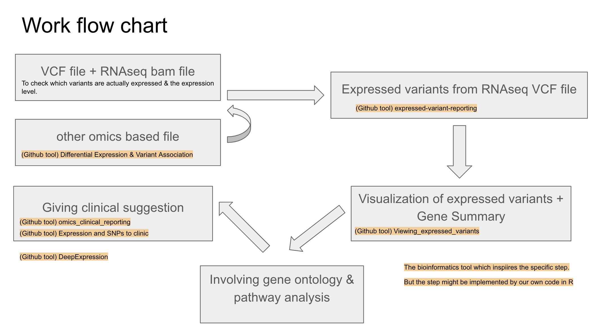
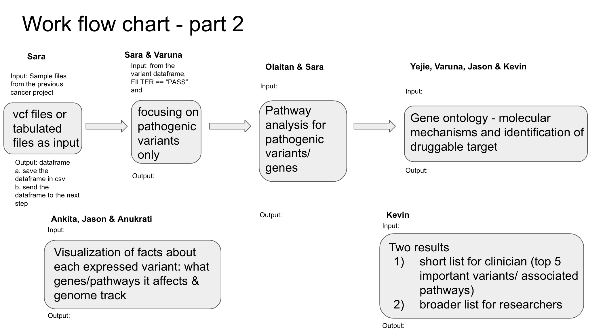

# Viewing_expressed_variants

## Contributors 
-  Kevin Elaba, Ankita Murmu, Rajarshi Mondal, Anukrati Nigam, ChunHsuan LO (Jason) - **Sysadmin** 
-  Ahmad Khleifat, Olaitan Awe, Varuna Chander - **Tech support**
-  Sara Carioscia, Yejie Yun - **Writer**
-  Kevin Elaba - **Slides construction** 
-  Yejie Yun, Anukrati Nigam - **Results presenter & advertisements** 
-  Yejie Yun, Rajarshi Mondal, Ankita Murmu, Olaitan I. Awe, ChunHsuan LO (Jason) - **Github maintenance**
-  ChunHsuan LO (Jason) - **Lead, Liaison** 

## Goal 
To visualize the expression profiles and pathways associated with variants for suggesting clinical therapy target & drug usage.

## Introduction 
(Describe)

## Test Data 

## Installation 
**1.** Install the package
```
devtools::install_github("collaborativebioinformatics/Viewing_expressed_variants")
```
**2.**
```
(codes)
```

## Outlines


## Methods

### Inputs 
**VCF file (sample-> online data base - 1000 genome or etc.) + RNAseq bam file**
1. Expressed variants (VCF files from RNA seq data) -> NEED TO VISUALIZE THE COLUMNS IN THE FIELDS.
2. Making technical framework for input of VCF and BAM files for both visualization of reports as well as looking at the input of the read coverage for isoforms and gene count distribution.
### Outputs 
1. figures. (Overlapping SNV site to Expression level - read coverage, distribution of pathogenic variants, which genes have the highest overlap for pathogenic variants, circular-omic plot of overlap of structural variants) 
2. Table for statistics. (Fot those annotation recorded by the VCF files.) 
3. Gene ontology analysis. (for the expressed variants.) & Pathway analysis & KEGG 
4. To suggest clinical therapy target & drug usage.

### Detailed flow charts


#### Implementation 
I. Preparing the sample files:
**1.**
```
(codes)
```
----------//-------------//---------------------
II. Data cleaning for Vcf files or tabulated files as input (Sara):
**1.**
```
(codes)
```
----------//-------------//---------------------
III. Focusing on pathogenic variants only (Sara & Varuna):
**1.**
```
(codes)
```
----------//-------------//---------------------
IV. Pathway analysis for pathogenic variants & genes (Olaitan & Sara):
**1.**
```
(codes)
```
----------//-------------//---------------------
V. Gene ontology analysis - molecular mechanisms and identification of druggable target (Yejie, Varuna, Jason & Kevin):
**1.** Molecular mechanisms:
```
(codes)
```
**2.** Identification of druggable target:
```
(codes)
```
----------//-------------//---------------------
VI. Results integratiion (Kevin):
Two results short list for clinician
**1.** Top 5 important variants/ associated pathways:
```
(codes)
```
**2.** Broader list for researchers:
```
(codes)
```
----------//-------------//---------------------
VII. Visualization (Ankita, Jason & Anukrati):
**1.** Visualization of facts about each expressed variant: what genes/pathways it affects:
```
(codes)
```
**2.** Visualization of genome tracks where variants located:
```
(codes)
```
----------//-------------//---------------------

###Example outputs
1. results pictures:

For use by https://github.com/collaborativebioinformatics/Viewing_expressed_variants

## References 
- Data: https://XXX
- GATK Best Practices https://gatk.broadinstitute.org/hc/en-us/sections/360007226651-Best-Practices-Workflows 
- DNANexus documentation https://documentation.dnanexus.com/developer/apps/execution-environment/connecting-to-jobs 
- https://github.com/collaborativebioinformatics/omics_clinical_reporting
- https://github.com/collaborativebioinformatics/expression_and_SNPs_to_clinic
- https://github.com/collaborativebioinformatics/snpReportR
- https://github.com/collaborativebioinformatics/Differential_Expression_and_Variant_Association
- https://github.com/collaborativebioinformatics/DeepExpression (might be useful for both projects)

